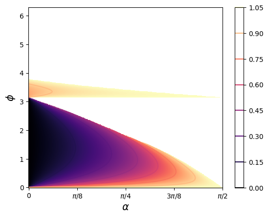
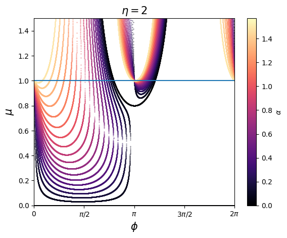
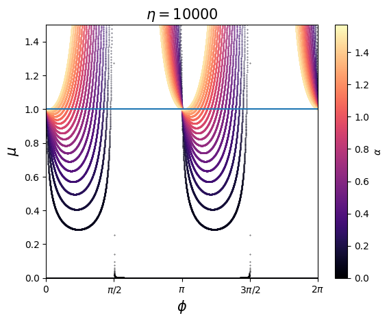
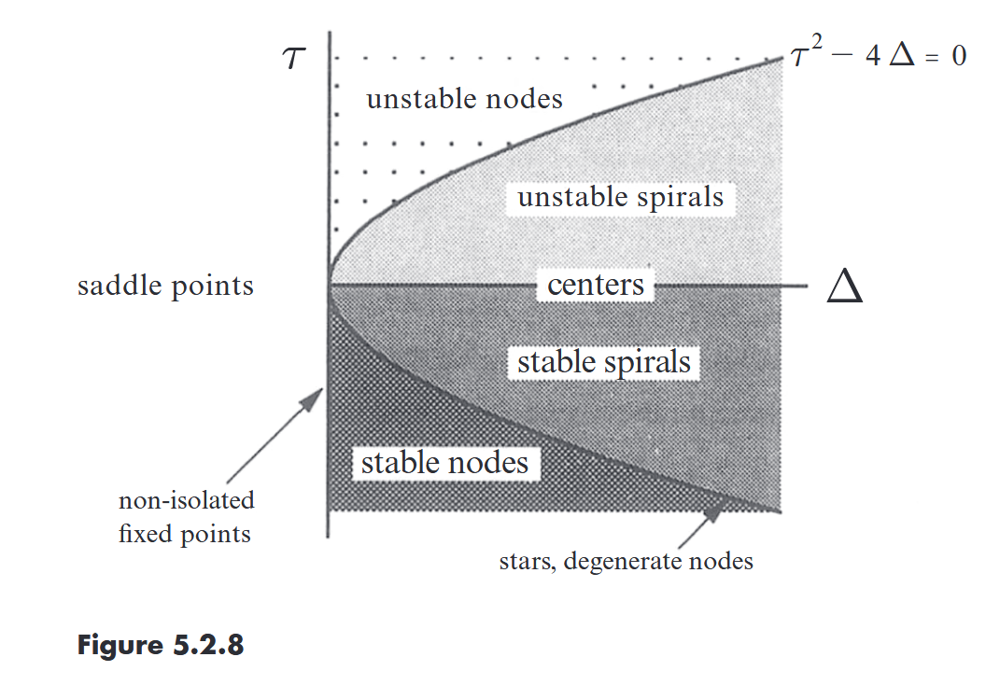
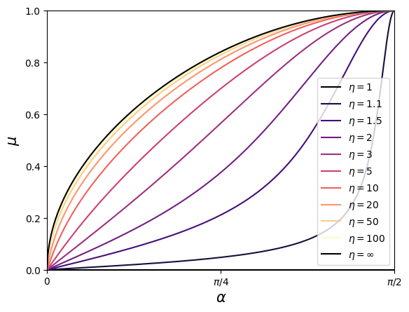

# check Analytic result
25.07.21

---

$\eta=2$로해서 얻은 시뮬레이션 결과, $\alpha$와 $\phi$의 조합에 따라서 다음과 같은 그래프가 나오며, 공통적으로 $\alpha$가 증가할 수록 더 좊은 영역의 fixed point를 가지며, 더 큰 $\mu$를 가지게 된다.

## Fixed point
각각의 $\alpha$와 $\phi$마다 하나의 fixed point를 가지게 된다. 또한 $\alpha$와 $\phi$마다 fixed point가 되는 $\mu$가 달라지며 이는 다음과 같다.

## Check Linear stability analtic
$$
\frac{d\dot{r}}{dr} = - 2 \eta^{2} \mu^{2} \cos{\left(\alpha + 2 \phi \right)} - 4 \eta \mu \cos{\left(\alpha + \phi \right)} - 2 \cos{\left(\alpha \right)}\\
\frac{d\dot{r}}{d\phi} = 0\\
\frac{d\dot{\phi}}{dr} = - 2 \eta \mu \sin{\left(\alpha - \phi \right)} + 2 \eta \mu \sin{\left(\alpha + \phi \right)} - 2 \mu^{2} \sin{\left(\alpha - 2 \phi \right)} + 2 \sin{\left(\alpha \right)}\\
\frac{d\dot{\phi}}{d\phi} = 2 \eta^{2} \mu^{2} \cos{\left(\alpha + 2 \phi \right)} + 2 \eta \mu \cos{\left(\alpha - \phi \right)} + 2 \eta \mu \cos{\left(\alpha + \phi \right)} + 2 \mu^{2} \cos{\left(\alpha - 2 \phi \right)}
$$

$$
\mu = \frac{- 2 \eta \sin{\left(\phi \right)} \cos{\left(\alpha \right)} - \sqrt{4 \eta^{2} \sin^{2}{\left(\phi \right)} \cos^{2}{\left(\alpha \right)} - \left(1 - \eta^{2}\right) \left(\eta^{2} \sin{\left(\alpha + 2 \phi \right)} - \sin{\left(\alpha - 2 \phi \right)}\right) \sin{\left(\alpha \right)}}}{\eta^{2} \sin{\left(\alpha + 2 \phi \right)} - \sin{\left(\alpha - 2 \phi \right)}}
$$

$$
J = \left[\begin{matrix} \frac{d\dot{r}}{dr} & \frac{d\dot{r}}{d\phi}\\\frac{d\dot{\phi}}{dr} & \frac{d\dot{\phi}}{d\phi}\end{matrix}\right]
$$

determinat가 0이 되는 지점은 다음과 같이 구성이 된다.
$$
\mu = \frac{- \cos{\left(\alpha + \phi \right)} + {\sin{\left(\phi \right)}}}{\eta \cos{\left(\alpha + 2 \phi \right)}} \\
\mu = \frac{- \cos{\left(\alpha + \phi \right)} - {\sin{\left(\phi \right)}}}{\eta \cos{\left(\alpha + 2 \phi \right)}}
$$
해당 지점은 $\frac{d\dot{r}}{dr}= 0$이 되는 부분을 확인한 것이다.

$$
\mu=-\frac{2 \eta \cos{\left(\alpha \right)} \cos{\left(\phi \right)}}{\eta^{2} \cos{\left(\alpha + 2 \phi \right)} + \cos{\left(\alpha - 2 \phi \right)}}
$$

Fixed point에서 $\alpha$를 고정 시키고, $\phi$에 대해서 미분해서 0이 되는 부분을 통해서 fixed point를 구할 수 있을 듯 한다.

$$
\frac{\left(\eta^{2} \sin{\left(\alpha + 2 \phi \right)} - \sin{\left(\alpha - 2 \phi \right)}\right) \left(- 4 \eta^{2} \sin{\left(\phi \right)} \cos^{2}{\left(\alpha \right)} \cos{\left(\phi \right)} - 2 \eta \sqrt{4 \eta^{2} \sin^{2}{\left(\phi \right)} \cos^{2}{\left(\alpha \right)} + \left(\eta^{2} - 1\right) \left(\eta^{2} \sin{\left(\alpha + 2 \phi \right)} - \sin{\left(\alpha - 2 \phi \right)}\right) \sin{\left(\alpha \right)}} \cos{\left(\alpha \right)} \cos{\left(\phi \right)} + \left(1 - \eta^{2}\right) \left(\eta^{2} \cos{\left(\alpha + 2 \phi \right)} + \cos{\left(\alpha - 2 \phi \right)}\right) \sin{\left(\alpha \right)}\right) + 2 \left(\eta^{2} \cos{\left(\alpha + 2 \phi \right)} + \cos{\left(\alpha - 2 \phi \right)}\right) \left(2 \eta \sin{\left(\phi \right)} \cos{\left(\alpha \right)} + \sqrt{4 \eta^{2} \sin^{2}{\left(\phi \right)} \cos^{2}{\left(\alpha \right)} + \left(\eta^{2} - 1\right) \left(\eta^{2} \sin{\left(\alpha + 2 \phi \right)} - \sin{\left(\alpha - 2 \phi \right)}\right) \sin{\left(\alpha \right)}}\right) \sqrt{4 \eta^{2} \sin^{2}{\left(\phi \right)} \cos^{2}{\left(\alpha \right)} + \left(\eta^{2} - 1\right) \left(\eta^{2} \sin{\left(\alpha + 2 \phi \right)} - \sin{\left(\alpha - 2 \phi \right)}\right) \sin{\left(\alpha \right)}}}{\left(\eta^{2} \sin{\left(\alpha + 2 \phi \right)} - \sin{\left(\alpha - 2 \phi \right)}\right)^{2} \sqrt{4 \eta^{2} \sin^{2}{\left(\phi \right)} \cos^{2}{\left(\alpha \right)} + \left(\eta^{2} - 1\right) \left(\eta^{2} \sin{\left(\alpha + 2 \phi \right)} - \sin{\left(\alpha - 2 \phi \right)}\right) \sin{\left(\alpha \right)}}}
$$

$\eta$에 따라서 fixed poin를 나타내면 다음과 같이 나타내게 된다. 각각의 선의 윗부분의 영역에 Fixed point가 존재하며, 아랫 부분에는 fixed ponint가 없다. (있긴 하지만, $\mu<0,\mu>1$인 의미가 없는 영역에서 Fixed point가 생기게 된다.)

